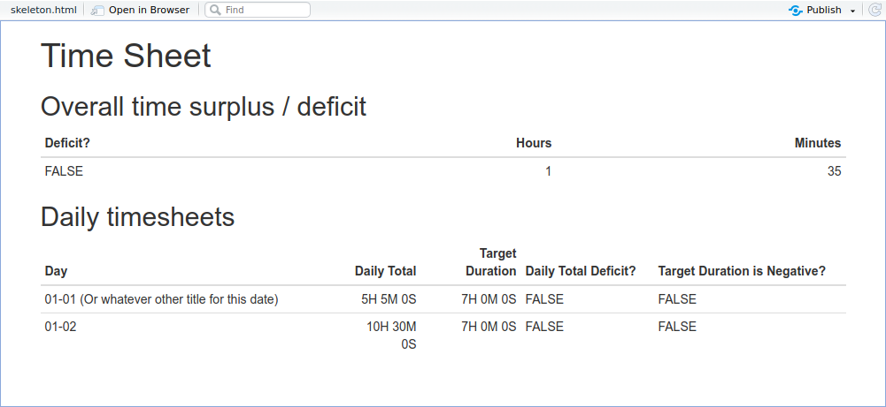

# Timelog

`timelog` is a package for calculating the amount of time one has worked on a project, relative to how much time one has meant to work on a project.

It takes a [YAML](https://en.wikipedia.org/wiki/YAML) collection of time entries and returns either:

1. A day-by-day tibble of time logged and whether that time was above or below a goal (for example, whether one worked more or less in a day than an expectation of _x_ hours), or:
2. A total calculation of the time one has logged above or below one's time goals (for example, if one has committed to work on a project for _x_ hours per week, how much time one has worked on the project relative to that goal).

## Usage

### RMarkdown template

`timelog` comes with an [RMarkdown](https://rmarkdown.rstudio.com/) template that can be used within [RStudio](https://rstudio.com/). It allows recording time entries at the top of the RMarkdown document, and compiling the document into a ready-made report:



### Commands

`timelog` features several primary functions:

1. `timelog::yaml_template`: Print a YAML template to start a timesheet with.
2. `timelog::parse_times`: Parse a YAML timesheet to create a summary table.

### From a `sh`/`bash` or similar UNIX shell

You can use `timelog` from a UNIX shell by saving a script (e.g., titled `timelog.R`), with the following contents:

```
#!Rscript
args <- commandArgs(trailingOnly=TRUE)

if (length(args) == 0) {
  stop("At least one argument must be supplied (input file)", call. = FALSE)
}

input <- yaml::read_yaml(args[1])
timelog::parse_times(
  input,
  returnIntermediateTable = ifelse(
    is.na(args[2]),
    FALSE,
    as.logical(args[2])
  )
)

```

You can then call the script from a shell with `Rscript timelog.R path/to/log-file.yaml`

## Developing

1. In RStudio, open `timelog.Rproj`
2. Run `packrat::on()`
3. Edit any files necessary for the work.
4. If you install packages, run `packrat::snapshot()`.
5. If you need to update documentation, run `devtools::document()`.

### Building and testing

For information on R packaging, see http://r-pkgs.had.co.nz/.

Keyboard shortcuts for package authoring within RStudio:

- Build and Reload Package: `Cmd + Shift + B`
- Check Package: `Cmd + Shift + E`
- Test Package: `Cmd + Shift + T`
